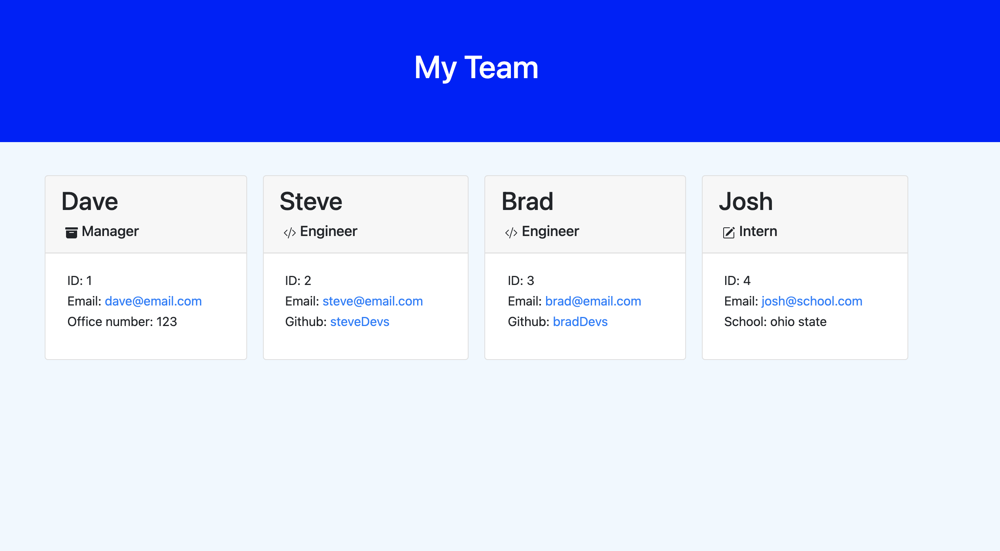

# Profile Generator

## Description
A simple CLI program to create a webpage that easily displays a team's information. Answer a series of prompts to complete the required information for each team member, and when finished a styled HTML file will be generated with your answers. 

## Links
Github repository: https://github.com/thebsking/profile-generator

Video overview: https://drive.google.com/file/d/1eDFCXRvjh4jCC8IHRoaW0zk6zKN9q6Sh/view

## Technologies Used
JavaScript, Node.js, HTML, CSS, jest, Inquirer

## Screenshot
Generated HTML page
